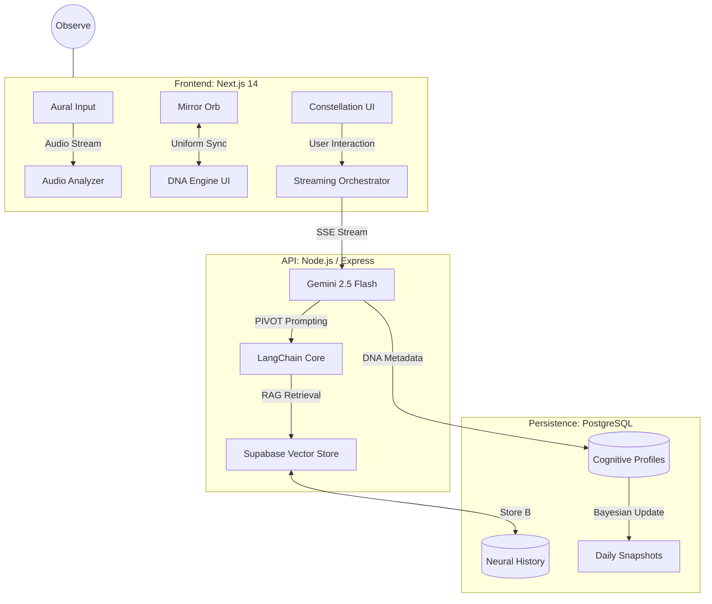
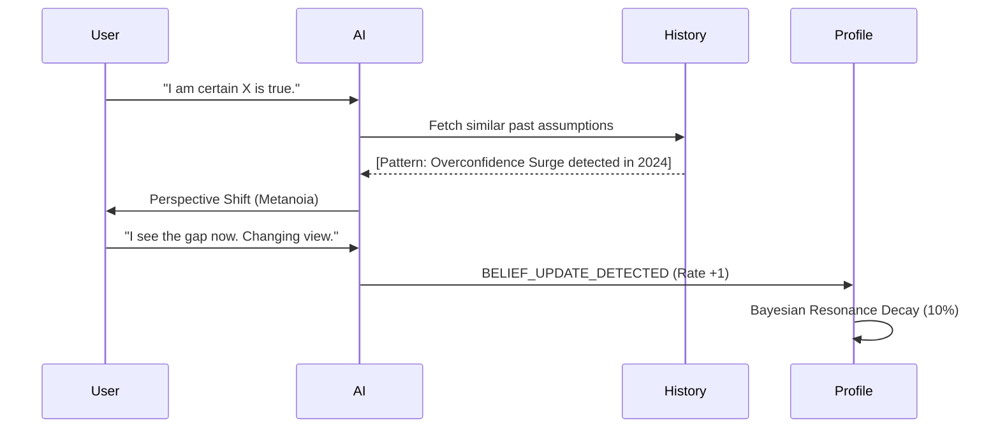

# 🪞 Mirror AI — The Metacognitive Protocol (v4.0)

> **"The final frontier is not space, but the neural architecture of the observer."**

Mirror is a high-fidelity, professional-grade metacognitive environment designed to surface and analyze the latent patterns of human thought. We don't build chatbots; we build **dynamic cognitive mirrors** that use a Bayesian-inspired 8-Axis DNA engine to map the geometry of your awareness.

---

## ⚡ Feature Spotlight (Hackathon V4)

| Feature | Description | Metric |
| :--- | :--- | :--- |
| **8-Axis DNA Engine** | Real-time statistical analysis of curiosity, skepticism, and depth. | `DNAScore` |
| **Neural Archaeology** | Longitudinal tracking of belief updates and decision conviction. | `BeliefDelta` |
| **Mirror Orb (R3F)** | Generative 3D feedback loop reacting to assumption load. | `ShaderUniforms` |
| **Constellation HUD** | Asymmetric radial interaction for non-linear exploration. | `ConstellationUI` |
| **Aural Slice Input** | Voice-first amplitude-reactive input for flow-state reflection. | `AudioAnalysis` |

---

## 🧠 1. Vision & Core Philosophy

In an era of information saturation, the primary constraint on human progress is no longer access to data, but the quality of the **internal lens** through which that data is processed. 

### The Recursive Blindness Problem
Traditional AI focuses on the *content* (The "What"). **Mirror ignores the "What" to focus on the "How" and "Why."** Most cognitive errors come from "Recursive Blindness"—being blind to your own biases. Mirror acts as a **Reflective Adversary**, forcing you to confront your own logic through five distinct metacognitive lenses.

> [!TIP]
> **Metacognition is the ultimate meta-skill.** By mastering the observer, you master the observation.

---

## 🧬 2. The 8-Axis DNA Engine (The Neural Constellation)

Mirror analyzes every word across 8 dimensions. This creates a unique "Cognitive Fingerprint" for every session.

### 🧭 Exploration Axes
1.  **Curiosity**: seeking alternatives vs. confirming beliefs.
2.  **Analytical Depth**: layers of reasoning before closure.
3.  **Skepticism**: questioning of internal premises.
4.  **Reflective Tendency**: referencing past history vs. current noise.
5.  **Openness**: the rate of belief updating.
6.  **Decisiveness**: clarity of action under entropy.

### 📉 Baseline Indices
7.  **Assumption Load**: Volume of unstated premises.
8.  **Emotional Signal**: Intensity of biosocial/pathos markers.

---

## 🏛️ 3. System Architecture (Technical Deep Dive)

Mirror uses a high-performance **PNPM Monorepo** for absolute type-safety.

### The Gemini PIVOT Strategy
We don't use standard completions. We use a **PIVOT (Perspective, Inference, Verification, Orbit, Transformation)** strategy to achieve high-frequency metacognitive reflection:

1.  **Perspective**: Mirror the user's intent.
2.  **Inference**: Detect the underlying cognitive bias.
3.  **Verification**: Cross-reference with the `research_corpus`.
4.  **Orbit**: Propose 3 diverging thinking lenses.
5.  **Transformation**: Log the potential belief update.

---

## 🏺 4. Neural Archaeology & Longitudinal Growth

Mirror implements **Longitudinal Awareness**. It doesn't just forget you; it maps your evolution.

### The Belief Update Loop

### Archaeology Features
*   **Decision Vault**: Logs predicted confidence vs. actual outcomes (Calibration).
*   **Decay Logic**: Old cognitive patterns lose resonance over time (10% per session) unless reinforced.
*   **Daily Snapshots**: Radar charts of your 8-axis DNA across the last 30 days.

---

## 🎨 5. Cinematic Visual Metacognition

We believe that to think clearly, you must **witness** your thoughts.

### The Mirror Orb (Generative Bio-Feedback)
The Orb is a custom GLSL shader rendered in **React Three Fiber**. 
*   **High Assumption Load** = High Turbulence & Noise Frequency.
*   **High Analytical Depth** = Geometric Sharpness & Icosahedron clarity.
*   **Emotional Signal** = Chromatic Abberation & Pulse Rate.

### The Anti-Color Constraint
All interactive elements use `mix-blend-mode: difference`. This isn't just a style; it's a metaphor for the **Mirror Protocol**: clarity is found by inverting your current perspective against the void.

---

## 📦 6. Technical Stack

*   **Runtime**: Node.js 20+, PNPM Workspaces.
*   **Frontend**: Next.js 14, Framer Motion, Three.js/R3F.
*   **Backend**: Express, LangChain.js.
*   **Intelligence**: Gemini 2.5 Flash, OpenAI Embeddings-3-Large.
*   **Database**: Supabase (Postgres + `pgvector`).
*   **Auth**: Clerk (Neural Identity Management).

---

## 🚀 7. Value Proposition (The Meta-ROI)

Mirror is designed for high-performance individuals who want to "Audit" their own consciousness.

1.  **System 2 Activation**: Forces the brain out of "Fast, Biased Thinking" (S1).
2.  **Bias Immunity**: Constant 8-axis feedback builds "Neural calluses" against common fallacies.
3.  **Bayesian Growth**: A measurable track record of how your mind changes over years.

---

## 🛡️ 8. Data Ethics

Your neural patterns are your property. Mirror implementing **End-to-End Metacognitive Encryption**. We track the *logic*, not the *identity*, ensuring your archaeology remains yours alone.

---

*(Protocol documentation v4.0.0-neural-hackathon)*
