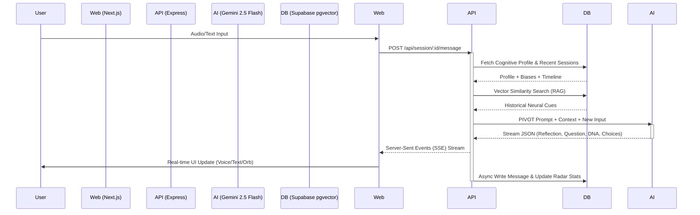

<div align="center">
  

  # Mirror AI: The Metacognitive Protocol (v4.0)

  **The final frontier is not space, but the neural architecture of the observer.**

  [](https://mirror-ai.vercel.app)
  [](https://vercel.com)
  [](https://www.typescriptlang.org/)
  [](https://ai.google.dev/)
  [](https://supabase.com/)

  *A professional-grade, high-fidelity metacognitive environment designed to surface and analyze the latent patterns of human thought through Bayesian belief tracking, an 8-Axis DNA engine, and a cinematic React Three Fiber interface.*
</div>

---

## ⚡ Executive Summary (Hackathon Pitch)
In an era defined by information saturation, the primary constraint on human progress is no longer access to data, but the quality of the "internal lens" through which that data is processed. Traditional AI interactions function as *oracles*—they provide answers, accelerating execution but bypassing the critical thinking process. This leads to cognitive atrophy.

**Mirror AI is not a chatbot; it is a dynamic cognitive mirror.** 

We built Mirror on the thesis that **metacognition—thinking about thinking—is the ultimate meta-skill.** Rather than answering the "What," Mirror acts as a "Reflective Adversary," interrogating the "How" and the "Why." Utilizing a highly optimized monorepo architecture (Next.js, Express, Supabase `pgvector`, and Gemini 2.5 Flash), Mirror reconstructs the user's neural logic, scores it across an **8-Axis Cognitive DNA Engine**, and visualizes the internal state using cinematic, audio-reactive 3D interfaces. Over time, Mirror conducts **Neural Archaeology**, tracking belief updates, decision calibration, and assumption loads longitudinally.

---

## 📖 Table of Contents
1. [The Problem: Recursive Blindness](#1-the-problem-recursive-blindness)
2. [The Solution: The Mirror Paradigm](#2-the-solution-the-mirror-paradigm)
3. [Deep Dive: The 8-Axis DNA Engine](#3-deep-dive-the-8-axis-dna-engine)
4. [Deep Dive: Neural Archaeology & Evolution](#4-deep-dive-neural-archaeology--evolution)
5. [System Architecture & Data Flow](#5-system-architecture--data-flow)
6. [Visual Metacognition: The Interface](#6-visual-metacognition-the-interface)
7. [AI Engineering: The PIVOT Methodology](#7-ai-engineering-the-pivot-methodology)
8. [Real-World Applications](#8-real-world-applications)
9. [Technical Stack](#9-technical-stack)
10. [Roadmap: The Neural Singularity](#10-roadmap-the-neural-singularity)

---

## 🧠 1. The Problem: Recursive Blindness

Human cognition is inherently flawed. We operate under constraints of limited working memory, bounded rationality, and deep-seated evolutionary biases. Daniel Kahneman outlined the dichotomy of System 1 (fast, intuitive, emotional, error-prone) and System 2 (slow, deliberate, logical, energy-intensive) thinking. 

### The Illusion of Objective Reality
When facing complex, high-entropy problems, humans default to System 1 heuristics to save metabolic energy. We experience **Recursive Blindness**—the inability to see the lenses through which we are viewing the world. We confuse our *models* of reality with reality itself. We fall prey to:
*   **Confirmation Bias:** Actively seeking data that validates our pre-existing mental models while aggressively discarding contradictory evidence.
*   **Sunk Cost Fallacy:** Tripling down on failing strategies because of past investments.
*   **Anchoring Bias:** Over-relying on the first piece of information encountered when making subsequent judgments.
*   **Assumption Overload:** Base-layering complex decisions on unverified, implicit hypotheses.

### The Failure of Traditional Generative AI
Standard Large Language Models (LLMs) exacerbate this problem. When a user asks an LLM to generate a business plan, write code, or solve a conflict, the LLM complies immediately. The user never engages System 2. The AI becomes a prosthetic crutch, leading to a degradation of the user's autonomous reasoning capabilities. We are solving problems faster, but we are becoming worse thinkers.

---

## 👁️ 2. The Solution: The Mirror Paradigm

Mirror AI rejects the oracle model. It serves as an intellectual sparring partner, an adversary to your assumptions. When you input a thought, fear, or strategic decision into Mirror, it does not solve it. It deconstructs it.

### The Reflective Loop
1.  **Ingestion:** The user speaks or types a raw, unfiltered thought stream.
2.  **Analysis:** The AI engine parses the text, extracting logical structure, emotional latency, and semantic vectors.
3.  **Reflection:** Mirror rephrases the core architecture of the user's thought, surfacing the implicit structure.
4.  **Provocation:** Mirror asks exactly one surgically precise question designed to break the current thought loop.
5.  **Multi-Modal Lenses:** Mirror offers distinct, radial choices (from 'Logos' logic to 'Pathos' emotion to 'Metanoia' paradigm shifts) forcing the user to select the *mode* of their next cognitive step.

This deliberate friction forces the user out of System 1 automation and into System 2 deliberation.

---

## 🧬 3. Deep Dive: The 8-Axis DNA Engine

Every interaction within Mirror is not just a conversation; it is a data point. The core of Mirror's analytical capability is the proprietary 8-Axis DNA Engine. Behind the scenes, the Gemini 2.5 Flash execution model acts as a psychologist, scoring the user's input across eight fundamental dimensions (0-100 scale) in real-time.

### A. The Six Explorative Axes (Dynamic State)
These axes measure the *quality* and *vector* of the cognitive exploration during an active session.

| Axis | Description | High Score (80-100) Indicator | Low Score (0-20) Indicator |
| :--- | :--- | :--- | :--- |
| **Curiosity** | Seeking alternatives over confirming. | Asking open questions, expressing genuine wonder about the "why" behind an event. | Making absolute statements, rejecting external input, rushing to conclusions. |
| **Analytical Depth** | Multi-stepped reasoning processes. | Breaking down problems into constituent parts, analyzing second-order consequences. | Relying on gut feelings, surface-level heuristics, or ad-hominem attacks. |
| **Skepticism** | Questioning starting internal premises. | "I'm assuming X is true, but what if it isn't?", actively hunting for personal blind spots. | Accepting first impulses as objective truth. Taking axioms for granted. |
| **Reflective Tendency** | Synthesis of past and present. | Drawing parallels to historical decisions, evaluating how thoughts have evolved over the session. | Purely reactive, living entirely in the immediate context of the prompt. |
| **Openness** | Capacity for belief updating. | Demonstrating a willingness to abandon a previously held strong conviction given new perspective. | Defensive posturing when a 'Metanoia' (Shift) lens is applied by the Mirror. |
| **Decisiveness** | Action-selection under entropy. | Forming a definitive conclusion or path forward after sufficient exploration, despite lacking total data. | Analysis paralysis, infinite rumination without synthesizing into a pragmatic outcome. |

### B. The Two Baseline Indices (Latent State)
These metrics operate as the foundational terrain upon which the explorative axes exist.

*   **Assumption Load:** Formally measures the density of unstated or unverified premises required to make the user's logic hold true. A high assumption load is a critical liability in strategic thinking. Mirror detects phrasing like "obviously," "they must think," or "it's inevitable that."
*   **Emotional Signal:** Measures the intensity of subjective affect, biological markers in language, and pathos-driven structure. Mirror does not judge emotion as bad; a high Emotional Signal combined with high Analytical Depth often points to profound personal insight.

```mermaid
radarChart
    title Current Neural DNA Signature
    "Curiosity" : 85
    "Analytical Depth" : 60
    "Skepticism" : 40
    "Reflective Tendency" : 70
    "Openness" : 90
    "Decisiveness" : 30
```
*(The UI renders this data dynamically for the user, providing a biofeedback loop for their intellect).*

---

## 🏛️ 4. Deep Dive: Neural Archaeology & Evolution

A conversation with a standard LLM disappears when the window closes. Mirror operates on a timeline of years. We implemented a sophisticated system termed **Neural Archaeology** to map longitudinal cognitive growth. 

### Store A and Store B Architecture
*   **Store A (Active Working Memory):** The immediate session. Transcripts are passed to the context window to maintain flow state.
*   **Store B (Long-Term Vector Memory):** As a session closes, the orchestration engine executes a "Recursive Summary." It compresses the entire session discourse, identifies the dominant biases present, and embeds this summary via `pgvector` into the `session_chunks` table within Supabase. 

When a user begins a *new* session a month later, Mirror performs a Semantic Vector Search against Store B, injecting relevant historical blind spots into the prompt context via **Retrieval-Augmented Generation (RAG)**. The AI can say, *"You are expressing frustration about this project's timeline. You exhibited an identical Assumption Load regarding timelines last month during the 'Alpha Launch' reflection. Are we repeating a pattern?"*

### Longitudinal Decision Calibration
Mirror actively detects when a user makes a prediction or commits to a high-stakes decision. 
Through the `decisions` table:
1.  **Commitment:** The user states a decision ("I am resigning today").
2.  **Extraction:** The AI extracts the Predicted Confidence (e.g., 85%) and the core Assumptions supporting the decision.
3.  **Resolution:** Weeks later, Mirror prompts the user to resolve the decision. It calculates the **Calibration Gap**—the mathematical difference between how confident you were and whether the outcome was actually positive. Over time, Mirror trains you to perfectly calibrate your confidence to reality.

### Bayesian Belief Updates
Mirror calculates a **Belief Update Rate**. By comparing the user's initial axiom at the start of a session to their synthesized conclusion at the end, the AI determines if a true 'Metanoia' (change of mind) occurred. This contributes to a daily cognitive snapshot, plotting the user's intellectual agility on a macro scale.

---

## ⚙️ 5. System Architecture & Data Flow

Mirror is engineered as a high-performance **PNPM Monorepo**, ensuring absolute type-safety between the database, the backend orchestration API, and the frontend client interface.

### High-Level Monorepo Structure
*   `apps/web`: The Next.js 14 frontend. Cinematic UX, Server-Side Rendering.
*   `apps/api`: The Express/Node.js backend. Handles API routes, streaming SSE connections, and heavy AI logic.
*   `packages/types`: Shared TypeScript interface definitions (`Message`, `Session`, `DNAScore`).
*   `packages/ai`: The intelligence layer wrapping LangChain, RAG, and prompt coordination.

### Data Architecture Flowchart



### The Database Topology (Supabase)
We leverage PostgreSQL with the `pgvector` extension for seamless integration of relational data and high-dimensional embeddings.
*   `users`: Clerk-synced identity layer.
*   `sessions`: Metadata for specific reflection periods.
*   `messages`: JSONB metadata columns store the granular 8-axis DNA per turn.
*   `cognitive_profiles`: The master Bayesian tracker for the user. Stores rolling averages, weekly insights, and dominant historical biases.
*   `session_chunks`: 1536-dimensional embeddings of compressed past sessions for RAG.
*   `decisions`: The archaeological ledger of predictions and outcomes.
*   `daily_cognitive_snapshots`: Time-series data for charting the user's progression over months and years.

---

## 🎨 6. Visual Metacognition: The Interface

The user interface of Mirror is deliberately hostile to standard SaaS conventions. It is designed to induce a specific psychological state: **profound introspection**. We achieved this through absolute minimalism, cinematic motion, and physicalized data.

### The Mirror Orb (React Three Fiber)
The centerpiece of the application is the Mirror Orb, a procedural 3D shader built with WebGL and React Three Fiber.
*   **Audio-Reactivity:** As the user speaks, the amplitude data from their microphone is processed via the Web Audio API to directly distort the vertex shader of the Orb, creating a physical manifestation of their voice.
*   **DNA Binding:** The physical properties of the Orb are bound to the user's real-time DNA scores. High `Assumption Load` increases surface turbulence. A high `Emotional Signal` shifts the chromatic dispersion toward volatile reds and violets. High `Analytical Depth` induces a slow, geometric, crystalline spin.

### The Metacognitive Horizon (UI Layout)
Standard chat UIs prioritize linear chronological reading. We use an asymmetric editorial layout.
*   **The Reflection Core:** The AI's reflection dominates the center of the screen in profound, oversized serif typography.
*   **The Neural Constellation:** Instead of standard buttons for choices, Mirror maps the user's next potential paths in a radial SVG constellation. Each node represents a different lens (`Logos`, `Pathos`, etc.).
*   **Anti-Color Blending:** To ensure legibility without relying on solid, ugly background boxes, the entire interface utilizes CSS `mix-blend-mode: difference`. As the 3D Orb pulses beneath the text, the text dynamically mathematically inverts its color to maintain perfect contrast.
*   **Contextual Blurring:** When profound reflections are rendered, the background environment undergoes a heavy backdrop blur (`blur-[40px]`), physically narrowing the user's visual focus to match their cognitive focus.

---

## 🧠 7. AI Engineering: The PIVOT Methodology

Standard prompt engineering results in standard, boring outputs. To make Mirror function as a high-level executive coach or philosophical adversary, we designed the **PIVOT** prompting methodology for our Gemini 2.5 Flash execution layer.

*   **P - Perspective constraint:** The model is strictly instructed to speak in the second person ("You are doing X"), never generating "I think" or "As an AI" statements. It acts as a mirror, not a persona.
*   **I - Inference extraction:** The model does not just summarize; it infers the latent structure. It looks for logical fallacies (e.g., *Slippery Slope, False Dilemma*).
*   **V - Verification questioning:** The model is constrained to output exactly **one** follow-up question. This prevents interrogation fatigue and maximizes the weight of the inquiry.
*   **O - Orbit generation (Choices):** The model dynamically generates 3-5 distinct cognitive "Nodes" for the user to select from, categorizing them strictly into pre-defined psychological states (Logic, Emotion, Metaphor).
*   **T - Transformation scoring:** The model simultaneously analyzes the linguistic payload to output the 8-Axis DNA JSON.

Because we demand structured JSON enforcing these 5 constraints synchronously while streaming, we heavily rely on LangChain's Structured Output Parsers and the phenomenal speed of Gemini 1.5/2.5 Flash to ensure sub-second Time-To-First-Token (TTFT).

---

## 🌍 8. Real-World Applications

Mirror is a paradigm-shifting tool for anyone operating in high-complexity, high-stress environments where decision quality is paramount.

### For Founders & Executives
A CEO evaluating a major pivot can process their reasoning through Mirror. Mirror identifies that their decision relies on a massively high `Assumption Load` regarding competitor timelines, and prompts them to separate verifiable evidence from gut feeling, while tracking this strategic decision in the Neural Archaeology ledger.

### For Researchers & Academics
Academics working through complex theoretical bottlenecks can use Mirror to trace the architecture of their arguments. By selecting the `Skepticism` or `Metanoia` lenses, Mirror forces the researcher to actively argue against their own thesis, surfacing structural flaws before peer review.

### For Creative Professionals
Writers and designers experiencing creative block can engage Mirror using `Mythos` (Metaphorical) lenses. Mirror maps their current narrative structure and suggests lateral cognitive jumps, increasing their `Curiosity` and `Openness` scores and breaking repetitive idea generation loops.

### For Personal Growth and Therapy
While not a medical device, Mirror acts as an unparalleled daily journaling and cognitive behavioral tracking tool. Users can visualize their `Emotional Signal` spikes over a week and analyze the exact thought patterns that preceded them, fostering elite-level emotional regulation and self-awareness.

---

## 🛠️ 9. Technical Stack

Mirror is built on a battle-tested, modern web stack chosen for performance, type-safety, and cinematic capabilities.

### Frontend (`apps/web`)
*   **Framework:** Next.js 14 (App Router)
*   **Language:** TypeScript
*   **Styling:** Tailwind CSS, PostCSS
*   **Animation & 3D:** Framer Motion, Three.js, React Three Fiber (R3F), Drei
*   **State & Data:** React Hooks, Server-Sent Events (SSE) reading
*   **Authentication:** Clerk (Zero-trust secure auth)

### Backend (`apps/api`)
*   **Framework:** Node.js, Express
*   **Language:** TypeScript
*   **AI Orchestration:** LangChain (Node.js SDK)
*   **LLM Provider:** Google DeepMind (Gemini 2.5 Flash)
*   **Streaming Logic:** Custom SSE Chunking Buffer

### Database & Infrastructure (`supabase`, `vercel`)
*   **Database:** Supabase PostgreSQL
*   **Vector Search:** `pgvector` extension for 1536d embeddings.
*   **Security:** Row-Level Security (RLS) policies protecting cognitive data.
*   **Hosting:** Vercel (Serverless Edge deployments for both Web and API).

---

## 🚀 10. Roadmap: The Neural Singularity

Protocol 4.0 is just the beginning. Our vision for Mirror AI extends far beyond individual sessions.

*   **V5.0: Collective Metacognition (The Neural Mesh):** Opt-in anonymized pattern matching. Mirror will detect if thousands of founders in a specific sector are simultaneously exhibiting high "Assumption Loads," surfacing macro-economic cognitive biases in real-time.
*   **V6.0: Biometric Convergence:** Direct API integration with Apple HealthKit and Oura Ring. Mirror's 3D Orb and DNA engine will cross-reference your `Skepticism` and `Analytical Depth` scores with your Heart Rate Variability (HRV) and REM sleep data, proving the link between biology and logic.
*   **V7.0: The Autonomous Adversary:** Currently, Mirror waits for input. In V7.0, Mirror operates asynchronously. Based on your calendar events or GitHub commits, Mirror will proactively send push notifications challenging a decision you are about to make, precisely when your historical data indicates your cognitive defenses are weakest.

---

<div align="center">
  <p><strong>Reflect. Deconstruct. Evolve.</strong></p>
  <p><em>Built with neural precision for the modern intellect.</em></p>
</div>
